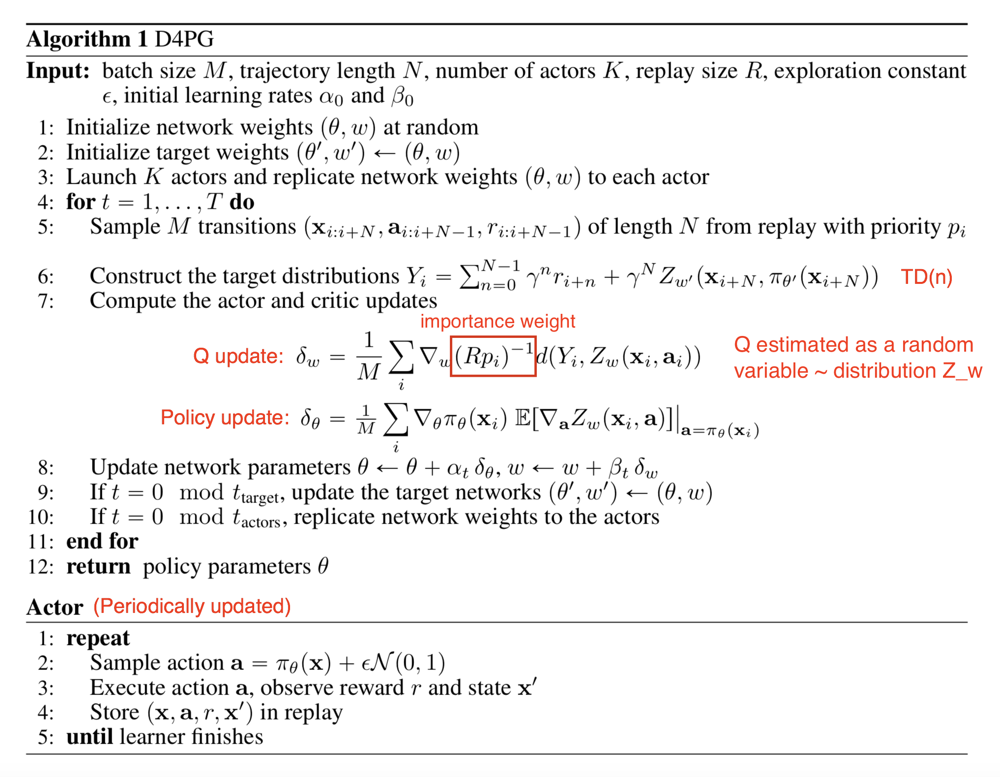
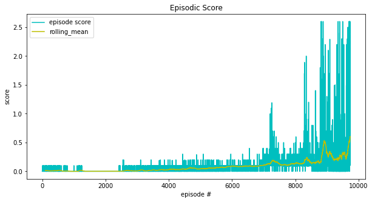

# Report Project 3 - Collaboration and Competition

## Part I - Theory

### Deep Deterministic Policy Gradient - DDPG

The employed D4PG algorithm is based on the DDPG (Deep Deterministic Policy Gradient) algorithm introduced in the paper [Continuous control with deep reinforcement learning](https://arxiv.org/abs/1509.02971). A brief description of the algorithm following the notation established in Project 1 and Project 2 follows.

Again the formal framework of a __Markov Decision Process__  (MDP) is used with

* a __state space__ $\mathbb{S}$ of states $S_t$
* an __action space__ $\mathbb{A}$ with $A_t \in \mathbb{R}^N$ 
* __transition dynamics__ $\mathbb{P}(S_{t+1}|S_t, A_t)$ that define the distribution of states that the agent can land on taking an action $A_t \in \mathbb{R}^N$ in state $S_t$, with initial state distribution $\mathbb{P}(S_1)$
* a __reward function__ $R(S_t, A_t)$

An agent's behavior is defined by a policy, $\pi$, which maps states to a probability distribution over the actions $\pi: \mathbb{S} \to \mathbb{P}(\mathbb{A})$. The return from a state is defined as the sum of discounted future reward $R_t = \sum_{i=t}^T \gamma^{(i-t)}R(s_i, a_i)$ with a discounting factor $\gamma \in [0, 1]$.

The goal of reinforcement learning is to learn a policy which maximizes the expected return from the start distribution $J=\mathbb{E}_\pi(R_1)$. The discounted state visitation distribution for a policy $\pi$ is denoted with $\rho^\pi$.

The action-value function describes the expected return after taking an action $A_t$ in state $S_t$ and thereafter following policy $\pi$:
$$
Q^{\pi}(S_t, A_t)=\mathbb{E}_\pi(R_t|S_t,A_t)
$$
The bedrock of many reinforcement learning algorithms is the Bellman equation which is given by 
$$
Q^\pi(S_t, A_t)=\mathbb{E}(R(S_t, A_t)+\gamma\mathbb{E}_\pi(Q^\pi(S_{t+1},A_{t+1}))).
$$
If the target policy is deterministic it can be described as a function $\mu: \mathbb{S}\leftarrow\mathbb{A}$ and the inner expectation can be avoided:
$$
Q^\mu(S_t, A_t)=\mathbb{E}(R(S_t, A_t)+\gamma Q^\mu(S_{t+1},A_{t+1})).
$$
Given that the remaining expectation depends only on the environment and not on the policy, it is possible to learn $Q^\mu$ off-policy, using transitions which are generated from a different stochastic behavior policy $\beta$.

Q-Learning, which is an off-policy algorithm, uses the greedy policy $\mu(s)=\text{argmax}_a Q(s,a)$. Function approximators parameterized by $\theta^Q$ are used, which are optimized by minimizing the loss:
$$
L(\theta^Q)=\mathbb{E}\left(\left(Q(S_t, A_t|\theta^Q)-Y_t\right)^2\right)
$$
where
$$
Y_t = R(S_t,A_t)+\gamma Q(S_{t+1}, \mu(S_{t+1})|\theta^Q)
$$
While $Y_t$ is also dependent on $\theta^Q$, this is typically ignored.

Using non-linear function approximators with a large number of parameters for learning action-value functions has previously been avoided as theoretical performance guarantees are impossible and practically learning is unstable. Q-Learning became usable in practice with the introduction of two major changes:

* the use of a __replay buffer__ and
* a separate __target network__ for calculating $Y_t$

In continuous action spaces $\mathbb{A}$ it is not straightforward to apply Q-Learning, because finding the greedy policy in each timestep requires evaluating an optimization problem, which is too slow to be practical with large, unconstrained function approximators and large action spaces.

Instead DDPG builds on the actor-critic approach introduced by the DPG algorithm introduced in [Deterministic Policy Gradient Algorithms](http://proceedings.mlr.press/v32/silver14.pdf).

The DPG algorithm maintains a parameterized actor function $\mu(s|\theta^\mu)$ which specifies the current policy by deterministically mapping states to a specific action. The critic $Q(S,A)$ is learned using the Bellman equation as in Q-Learning. The actor is updated by applying the chain rule to the expected return from the start distribution $J$ with respect to the actor parameters:
$$
\begin{align}
\nabla_{\theta^\mu}J &\approx \mathbb{E}_{\rho^\beta}(\nabla_{\theta^\mu}Q(S,A|\theta^Q)|_{S=s_t,A=\mu(s_t|\theta^\mu)}) \\
&=\mathbb{E}_{\rho^\beta}(\nabla_A Q(S,A|\theta^Q)|_{S=s_t,A=\mu(s_t)}\nabla_{\theta_{\mu}}\mu(s|\theta^\mu)|_{S=s_t})
\end{align}
$$
This is the policy gradient, the gradient of the policy's performance.

The first major change to the application of neural networks to DPG previously mentioned is the use of a __replay buffer__. The replay buffer is a finite sized cache $\mathcal{R}$. Transitions are sampled from the environment according to the exploration policy and the tuple $(S_t, A_t, R_t,S_{t+1})$ is stored in the replay buffer. When replay buffer is full the oldest samples are discarded. At each timestep the actor and the critic are updated by sampling a minibatch uniformly from the buffer. Because DDPG is an off-policy algorithm, the replay buffer can be large, allowing the algorithm to benefit from learning a set of uncorrelated transitions.

Additionally, a __target network__ is deployed by using soft target updates, rather than directly copying the weights. A copy of the actor and critic networks $Q'(S,A|\theta^{Q'})$ and $\mu'(s|\theta^{\mu'})$ that is used for calculating the target values. The weights of these target networks is then updated by having them slowly track the learned networks: $\theta' \leftarrow \tau \theta +(1-\tau)\theta'$ with $\tau \ll 1$. Thus, the target values are constrained to change slowly, greatly improving the stability of the learning.

In order to do better exploration, an exploration policy $\mu'$ is constructed by adding a noise process $\mathcal{N}$ to the actor policy:
$$
\mu'(s_t)=\mu(s_t|\theta^\mu_t)+\mathcal{N}
$$

### Distributed Distributional Deep Deterministic Policy Gradients - D4PG

__Distributed Distributional DDPG__ applies a set of improvements on DDPG to make it run in a distributional fashion.

1. __Distributional Critic__: The critic estimates the expected $Q$ value as a random variable, a distribution $Z_w$ parameterized by $w$ and therefore $Q_w(S,A)=\mathbb{E}(Z_w(S,A))$. The loss that is to be minimized for learning the distribution parameter is constructed through some measure $d$ of the distance between two distributions, the distributional TD error $L(w)=\mathbb{E}(d(\mathcal{T}_{\pi_{\theta}},Z_w'(S,A), Z_w(S,A)))$ , where $\mathcal{T}_{\mu_{\theta}}$ is the Bellman operator. The deterministic policy gradient update becomes:
   $$
   \begin{align}
   \nabla_{\theta^\mu}J &\approx \mathbb{E}_{\rho^\beta}(\nabla_A Q_w(S,A|\theta^Q)|_{S=s_t,A=\mu(s_t)}\nabla_{\theta_{\mu}}\mu(s|\theta^\mu)|_{S=s_t}) \\
   &=\mathbb{E}_{\rho^\beta}(\mathbb{E}(\nabla_A Z_w(S,A|\theta^Q)|_{S=s_t,A=\mu(s_t)})\nabla_{\theta_{\mu}}\mu(s|\theta^\mu)|_{S=s_t})
   \end{align}
   $$

2. 

2. __N-step returns__: When calculating the TD error, D4PG computes the N-step TD target rather than the one-step TD target to incorporate rewards of more future steps.
3. __Multiple Distributed Parallel Actors__: D4PG utilizes $K$ independent actors, gathering experience in parallel and feeding data into the same replay buffer.
4. __Prioritized Experience Replay__: The last modification is to do sampling from the replay buffer of size $R$ with a non-uniform probability $p_i$. This way, a sample $i$ has the probability $(Rp_i)^{-1}$ to be selected, which is the importance weight.

## Part II - Practice

The selected model is a multi-agent D4PG model, based on the positive experience with D4PG in the previous project. For this project, two instances of the D4PG model are set up, one for each of the agents. 

### Distributed Distributional Deep Deterministic Policy Gradients - D4PG

The code is largely derived from the code coming with the book [Deep Reinforcement Learning Hands-On]( https://github.com/PacktPublishing/Deep-Reinforcement-Learning-Hands-On), which in turn is based on the methodology described in the [paper introducing D4PG](https://arxiv.org/abs/1804.08617). Although the algorithm does accommodate multiple transition trajectory (N-steps), a one-step transition model is chosen instead. For both actor and critic networks, there are two hidden layers of size 64. The leaky ReLU activation function is used. For the actor network the output of the output layer is batch normalized before being passed on to the tanh activation function; the resulting range of action values is then mapped to the range $[0,1]$.

Instead of the Ornstein-Uhlenbeck process used in the Udacity template for exploration in DDPG, in this case a white noise process is used. 

The replay memory is randomly sampled with batch size 64.

##### Hyperparameters

- Learning Rate Actor: 1e-4
- Learning Rate Critic: 1e-3
- Batch Size: 64
- Buffer Size: 100000
- Gamma: 0.99
- Tau: 1e-3
- Repeated Learning per time: 10
- N-step: 1
- N-Atoms: 51
- Vmax: 1
- Vmin: -1
- Hidden Layer 1 Size: 64
- Hidden Layer 2 Size: 64

 

## Part III - Improvements

* **N-step returns for D4PG**: Use N-step returns instead of the actually deployed one-step returns. This usually increases the stability of the algorithm.
* __Prioritized Memory Replay__: Prioritized memory replay can help with increasing the learning efficiency.